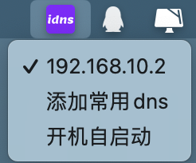
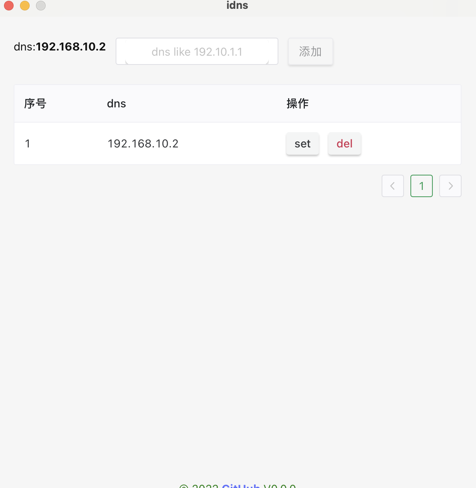

  

### idns（目前只支持 macos）

- 用与更快捷的切换常用 dns

- rust 好难啊，我只能写点简单的东西了

### 软件截图

  
  

### TODOS
- 让托盘icon图动起来（没啥用，就觉得炫酷点）[准备一组图片帧循环设置icon]

- 支持 windows,linux (没有开发环境,暂不考虑支持,欢迎提供实现)

### 鸣谢

  

### 相关项目

[sysdns](https://github.com/NahidaBuer/sysdns)

[icon 生成器](https://favicon.io/favicon-generator)

# 免责声明

### 该软件仅用于个人学习使用

- 禁止商用或者非法用途.
- 禁止商用或者非法用途.
- 禁止商用或者非法用途.
